# React vs Vue 框架对比

## 1. React 框架和 Vue 的区别

### 快速回答
React 和 Vue 都是流行的前端框架/库，但 React 更偏向灵活的 UI 库，强调"一切皆组件"和单向数据流；而 Vue 是渐进式框架，提供更完整的内置功能（如模板语法、双向绑定），上手更快。

### 核心理念对比

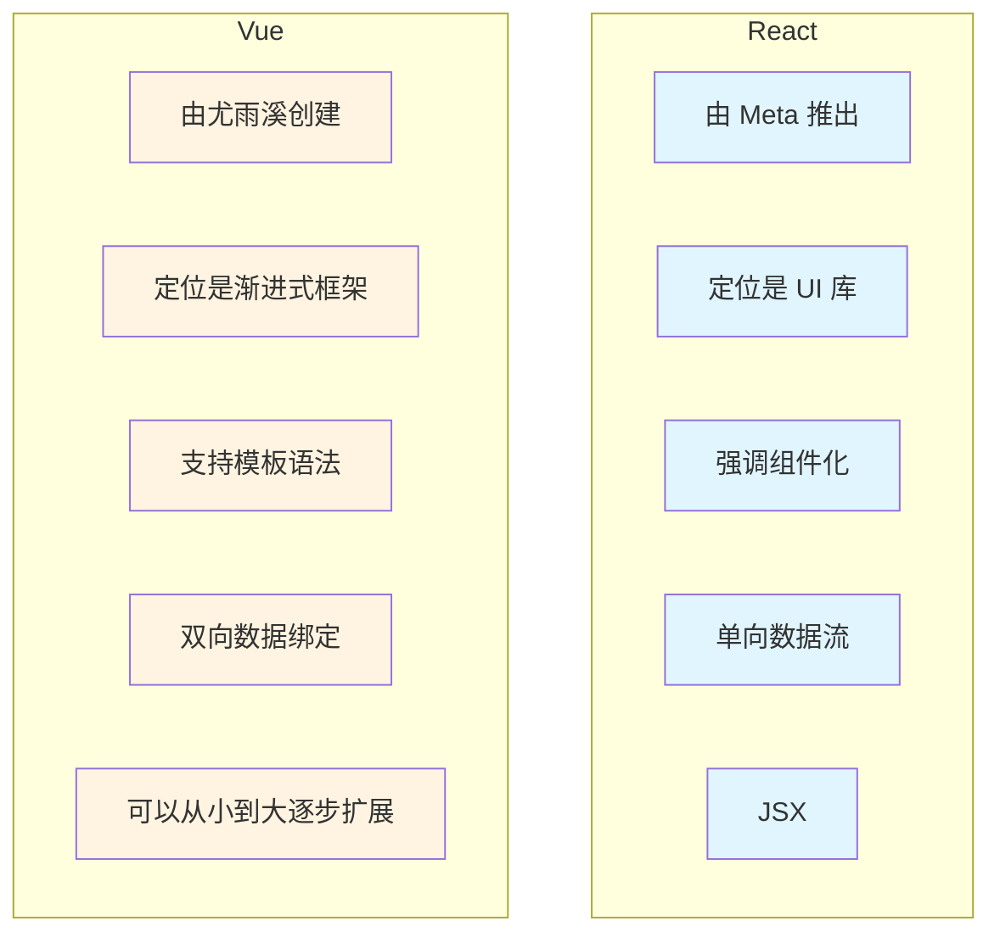

### 语法与开发体验对比

| 特性 | React | Vue |
|------|-------|-----|
| 语法 | 使用 JSX(JavaScript + XML)，逻辑和视图紧密结合 | 使用模板语法(v-if, v-for 等)，更接近 HTML，直观易学 |
| 学习曲线 | 学习曲线稍高，需要理解 Hooks, 状态管理等 | 对新手更友好，中文文档和社区资源丰富 |
| 代码风格 | JavaScript 中心 | HTML 中心 |

### 数据流与状态管理对比

| 特性 | React | Vue |
|------|-------|-----|
| 数据流 | 单向数据流，状态提升或借助 Redux, Zustand, Recoil 等库管理复杂状态 | 支持双向绑定(v-model)，官方提供 Pinia(新一代状态管理)和 Vuex(旧项目常用) |
| 状态管理 | 需要引入第三方库 | 官方提供完整解决方案 |

### 生态与工具链对比

| 特性 | React | Vue |
|------|-------|-----|
| 生态 | 生态庞大，配合 Next.js, React Native，适合跨平台和复杂应用 | 官方生态更完整：Vue Router, Pinia, Vite |
| UI 库 | Ant Design, Material UI | Element Plus, Naive UI |
| 构建工具 | Create React App, Vite, Next.js | Vue CLI, Vite |

### 使用场景对比

| 特性 | React | Vue |
|------|-------|-----|
| 适用场景 | 大型复杂应用，跨平台(Web + 移动端)，国际化业务 | 中小型项目，快速迭代，电商后台，国内团队 |
| 团队规模 | 适合大型团队 | 适合中小型团队 |

## 2. 什么是渐进式框架

### 简答
渐进式框架(Progressive Framework)是一种框架设计理念，强调可以按需逐步引入功能，而不是一次性接受庞大而固定的整体方案。典型代表就是 Vue.js，它允许你从最简单的页面渲染开始，随着项目复杂度增加，再逐步引入路由、状态管理、构建工具等模块。

### 渐进式框架特性

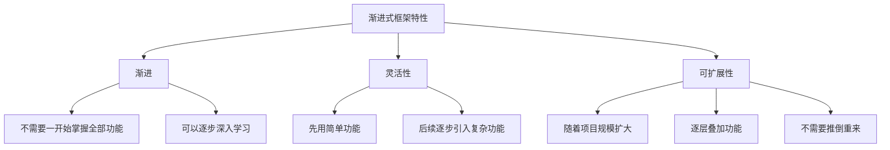

### 与传统框架的区别

| 特性 | 传统框架（如 Angular） | 渐进式框架（如 Vue） |
|------|----------------------|---------------------|
| 解决方案 | 提供一整套完整的解决方案（模块系统、依赖注入、路由、状态管理等） | 只提供核心功能（组件系统、响应式绑定），其他功能是可选的 |
| 开发规范 | 开发者必须遵循框架的规范 | 按需引入，灵活选择 |
| 学习曲线 | 陡峭，需要掌握整个框架体系 | 平缓，可以逐步学习 |

### 渐进式框架的优点

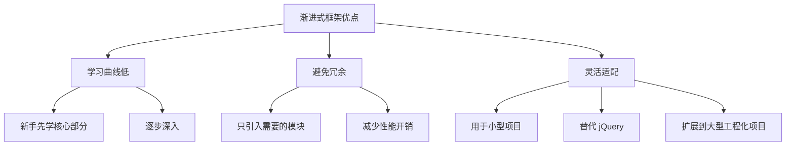

### 使用场景

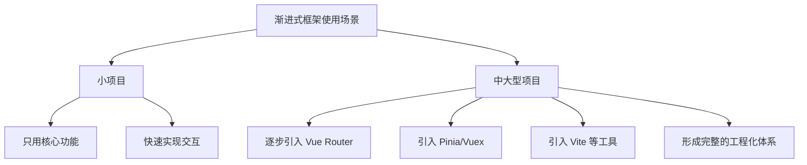

### 总结
渐进式框架 = 按需引入 + 灵活扩展。它的核心思想是：你用多少，就学多少；项目需要多少，就引入多少。这让框架既能轻量上手，又能支撑复杂应用。

## 3. 为什么 React 被称为 UI 库

### React 的定位

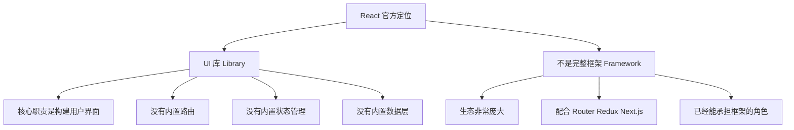

### 核心功能单一

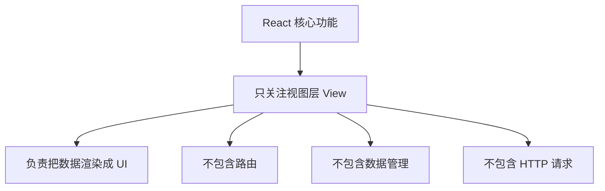

### 生态驱动

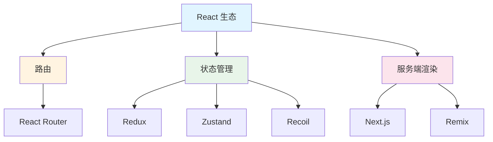

### 对比 Vue/Angular

| 特性 | React | Vue | Angular |
|------|-------|-----|---------|
| 定位 | UI 库 | 渐进式框架 | 完整框架 |
| 解决方案 | "拼装式"生态，需要开发者根据需求选择配套库 | 提供更完整的"全家桶"方案（路由、状态管理、构建工具都有官方支持） | 提供一整套完整的解决方案 |
| 核心引擎 | 更像是一个"核心引擎" | 官方生态完整 | 官方提供完整解决方案 |

### 实际使用中的"框架化"

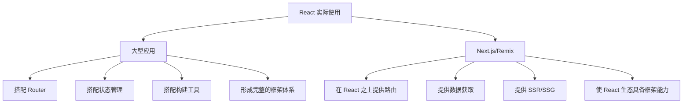

## 4. React vs Vue vs Angular 综合对比

### 综合对比表

| 特性 | React | Vue | Angular |
|------|-------|-----|---------|
| 定位 | UI 库 | 渐进式框架 | 完整框架 |
| 开发者 | Meta | 尤雨溪 | Google |
| 语法 | JSX | 模板语法 | TypeScript + 模板 |
| 数据流 | 单向数据流 | 双向绑定 | 双向绑定 |
| 状态管理 | 需要第三方库 | 官方提供 Pinia/Vuex | 内置服务 |
| 学习曲线 | 中等 | 简单 | 陡峭 |
| 生态 | 庞大 | 完整 | 完整 |
| 适用场景 | 大型复杂应用 | 中小型项目 | 企业级应用 |
| 跨平台 | React Native | - | - |

### 选择指南

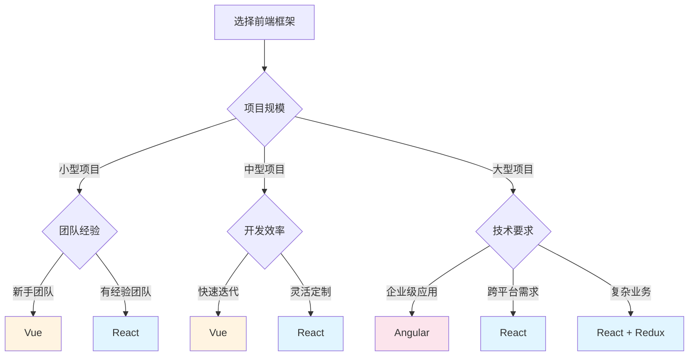

## 5. 重编译时 vs 重运行时

### Vue（重编译时）

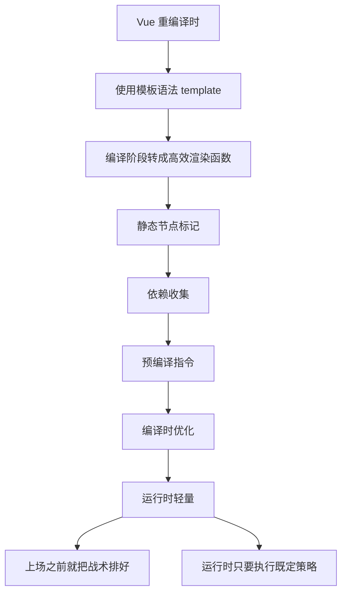

### React（重运行时）

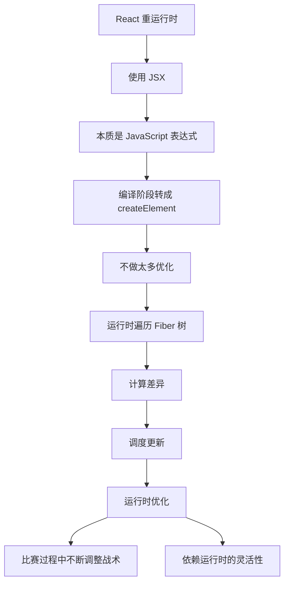

### 优化方式对比

| 特性/维度 | Vue（重编译时） | React（重运行时） |
|---------|----------------|------------------|
| 视图描述方式 | 模板语法 (<template>) | JSX（JavaScript 表达式） |
| 优化时机 | 编译阶段：在构建时分析模板，生成高效渲染函数 | 运行时：在渲染过程中遍历 Fiber 树，动态调度更新 |
| 典型优化手段 | 静态节点标记、依赖收集、预编译指令 | React.memo、PureComponent、shouldComponentUpdate 等运行时优化 |
| 渲染架构 | Virtual DOM + 编译时优化 | Fiber 架构（支持可中断渲染） |
| 性能瓶颈 | 编译时已优化，运行时压力较小 | 状态更新到视图变化之间的计算量大，容易卡顿 |
| 解决方案 | 编译器提前生成最优渲染逻辑 | 引入 Concurrent Mode：任务拆分 + 优先级调度 |
| 用户体验 | 流畅度依赖编译器优化结果 | 流畅度依赖运行时调度，能动态响应高优先级任务 |

### 总结
- Vue：靠编译器提前优化，运行时更轻量
- React：靠运行时调度（Fiber + Concurrent Mode）来保证流畅交互
- Concurrent Mode 的引入，就是为了让 React 在"重运行时"的路线下，也能像 Vue 一样流畅，但通过任务优先级 + 可中断渲染来实现
