# React 渲染机制详解

## 1. React 渲染基本概念

### 渲染的定义
渲染指的是：函数组件执行 + 虚拟DOM → 真实DOM更新

### 完整渲染流程图

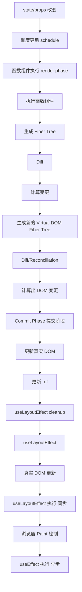

### 重要说明
- render 阶段不会操作真实 DOM，真正操作 DOM 的是：commit phase
- 任何地方调用 setState(useState定义的) 都会触发新一轮渲染
- render = 函数组件重新执行
- React 的渲染机制是：只要你调用了 setState，React 就会把这个组件标记为"需要更新"，然后在下一次调度时重新执行函数组件，生成新的虚拟 DOM，再对比并更新真实 DOM

## 2. useEffect vs useLayoutEffect

### 都会在组件第一次挂载时调用吗？
是的，两者在组件第一次挂载时都会调用，但它们的执行时机不同。

### 执行时机对比表

| 生命周期阶段 | useLayoutEffect | useEffect |
|-------------|----------------|-----------|
| 初次挂载 | 在 DOM 更新后，浏览器绘制前同步执行 | 在浏览器完成绘制后异步执行 |
| 依赖变化 | 先执行上一次清理函数 → 再执行新的回调(绘制前) | 先执行上一次清理函数 → 再执行新的回调(绘制后) |
| 阻塞绘制 | 会阻塞浏览器绘制 | 不会阻塞浏览器的绘制 |
| 卸载 | 执行清理函数 | 执行清理函数 |

### 主要区别对比表

| 特性 | useEffect | useLayoutEffect |
|------|-----------|-----------------|
| 执行时机 | 在浏览器完成渲染并绘制到屏幕之后异步执行 | 在 DOM 更新后，浏览器绘制前同步执行 |
| 阻塞绘制 | 不会阻塞浏览器绘制，适合大多数副作用逻辑 | 会阻塞绘制，保证在用户看到页面前完成 DOM 操作 |

### React 渲染流程时间线

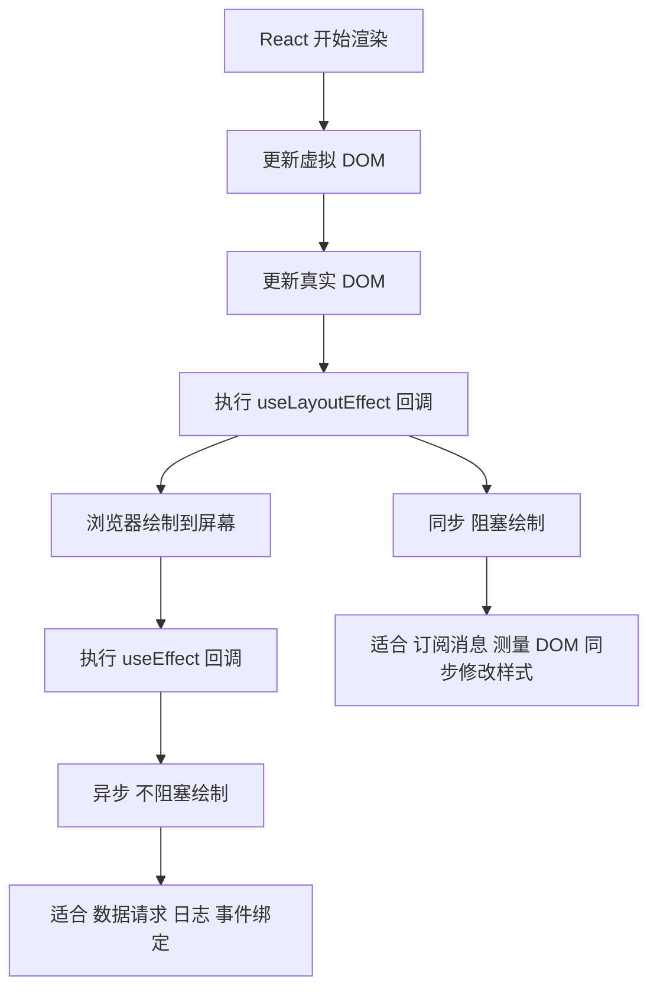

## 3. 何时使用 useLayoutEffect

### 必须使用 useLayoutEffect 的场景

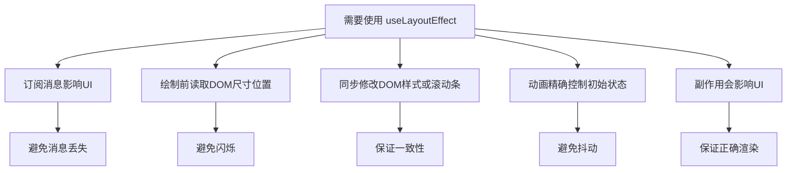

### 为什么在订阅 ROS1 消息时常用 useLayoutEffect

#### 需要同步建立订阅/广播
ROS 的 watch、advertise 本质上是和底层通信中间件建立连接。如果放在 useEffect，它会在绘制之后才执行，可能导致组件已经渲染出来，但订阅还没建立，出现"短暂空窗期"。

#### 避免竞态条件
有些场景下，组件渲染后马上就可能触发消息发布。如果订阅还没建立（因为 useEffect 是异步的），就会丢掉第一批消息。useLayoutEffect 保证在绘制前就完成订阅，避免消息丢失。

#### 和 DOM 无关，但和"同步初始化"有关
虽然这里不是直接操作 DOM，但 React 的生命周期钩子只有这两个选择。既然需要"同步初始化"，就只能用 useLayoutEffect。

### useLayoutEffect 和 useEffect 总结

- **useEffect**：适合异步副作用(请求、日志、事件绑定)，不影响首屏渲染
- **useLayoutEffect**：适合必须在绘制前完成的初始化逻辑
- 订阅 ROS1 消息属于"必须立即建立连接"的场景，所以一般写在 useLayoutEffect 里，避免丢消息或出现初始化延迟

## 4. 虚拟DOM机制

### 什么是虚拟DOM
虚拟 DOM(Virtual DOM)是对真实 DOM 的一种轻量级 JavaScript 对象表示。它描述了页面结构(标签、属性、子节点等)，框架(如 React,Vue)通过比较新旧虚拟 DOM 的差异(Diff)，再有选择地更新真实 DOM，从而提升性能和开发体验。

### 什么是DOM
DOM(Document Object Model) 是浏览器对 HTML 的对象化表示。每个标签、属性、文本节点都会对应一个 DOM 节点。操作 DOM(如 document.getElementById,innerText)会触发浏览器的重排和重绘，代价较高。

### 为什么要用虚拟DOM

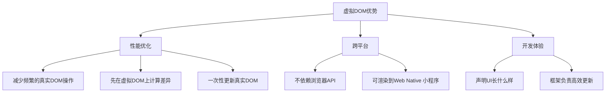

### DOM和虚拟DOM的工作流程

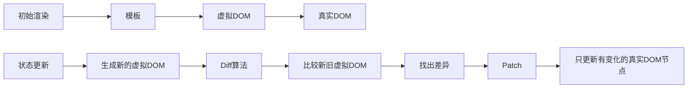

### DOM和虚拟DOM总结
- 虚拟 DOM = 真实 DOM 的 JS 抽象
- 核心价值：通过 Diff 算法减少不必要的真实 DOM 操作，提升性能和开发效率
- 应用场景：React、Vue 等现代前端框架的核心机制
- 在 React 中，渲染应该是纯粹的计算 JSX，不应该包含任何像修改 DOM 这样的副作用
- 使用 useEffect 包裹副作用，把它分离到渲染逻辑的计算过程之外

## 5. React 中能引起 UI 更新的来源

### UI 更新来源表

| 来源 | 会不会 render | 会不会更新 UI |
|------|--------------|---------------|
| setState/useState | ✅ | 可能 |
| props 变化 | ✅ | 可能 |
| context 变化 | ✅ | 可能 |
| 父组件 render | ✅ | 可能 |
| forceUpdate | ✅ | 可能 |
| useReducer dispatch | ✅ | 可能 |
| 外部 store（Redux/Zustand） | ✅ | 可能 |

### 最终分类（非常重要）

#### 会触发 render
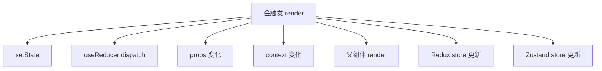

#### 不会触发 render
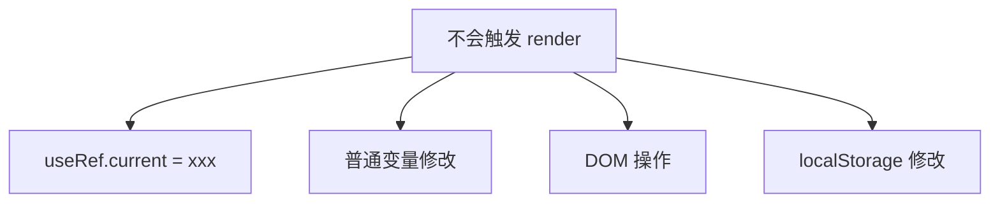

## 6. React UI 更新本质

一句话总结：React 的 UI 更新本质是：组件重新 render 后，新的 Virtual DOM 与旧 DOM diff，最后决定是否更新真实 DOM。setState 只是触发 render 的一种方式。

### 性能问题分析

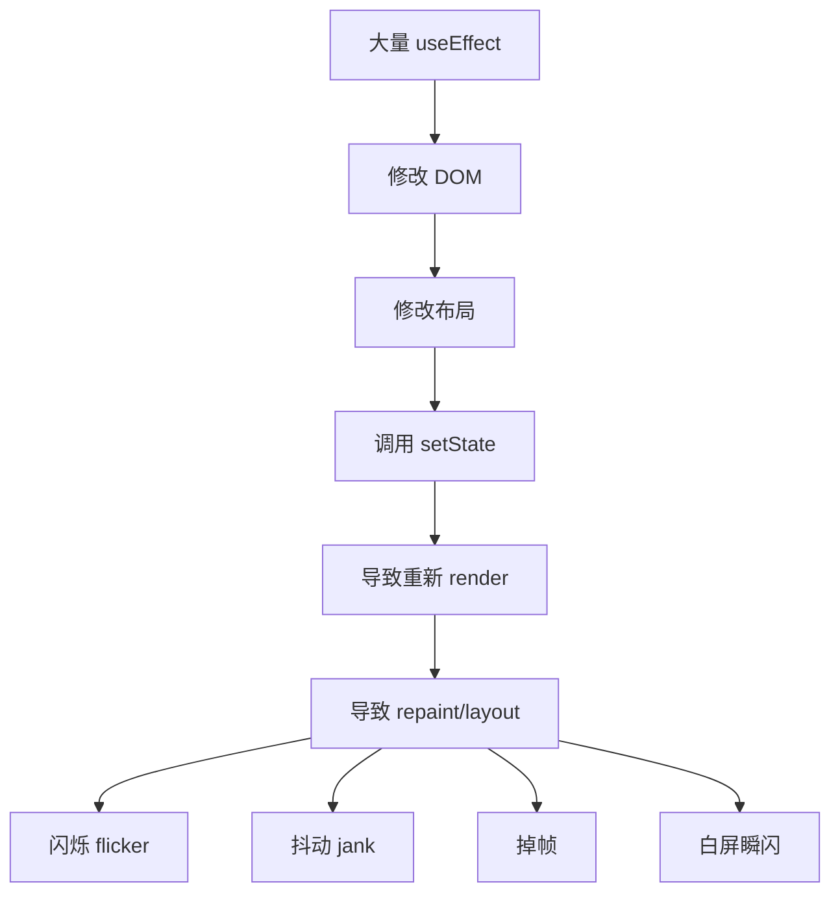

### 频繁 useEffect + setState 的危险

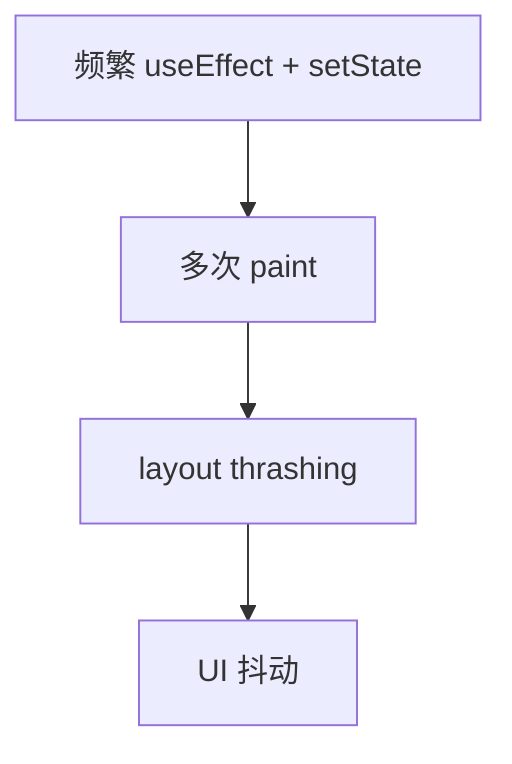

## 7. useEffect 的依赖和清理

### useEffect 依赖数组的不同

#### 每次渲染后运行
```javascript
useEffect(() => {
    // 这里的代码会在每次渲染后运行
});
```

#### 只在组件挂载时运行
```javascript
useEffect(() => {
    // 这里的代码只会在组件挂载(首次出现)时运行
}, []);
```

#### 挂载时运行，依赖变化时也运行
```javascript
useEffect(() => {
    // 这里的代码不但会在组件挂载时运行，而且当 a 或 b 的值自上次渲染后发生变化后也会运行
}, [a, b]);
```

### useEffect 的返回值（清理函数）

#### 基本规则
useEffect 的回调函数可以返回一个清理函数(cleanup function)。这个清理函数不会在 useEffect 本身执行时立即运行，而是在特定时机触发。

#### 执行时机

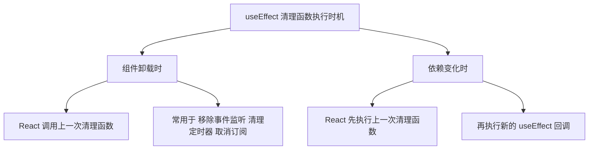

#### 不会在初次渲染前执行
初次渲染时，useEffect 的回调会执行，但清理函数不会执行。清理函数只会在下一次 effect 运行前或组件卸载时运行。

### useEffect 的 return 执行顺序

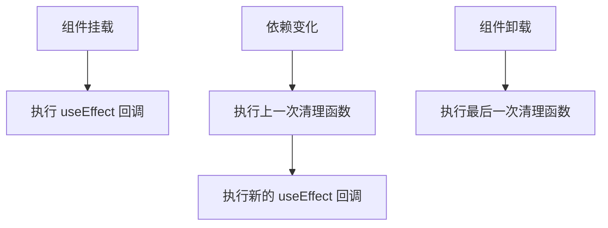

### 定时器的创建和清理

```javascript
useEffect(() => {
  const id = setInterval(() => {
    console.log("定时器运行中...");
  }, 1000);

  // 返回清理函数
  return () => {
    clearInterval(id);
    console.log("定时器已清理");
  };
}, []);
```

## 8. 经典死循环示例

这是新手最容易踩坑的：

```javascript
useEffect(() => {
  setCount(count + 1)
})
```

### 死循环流程图

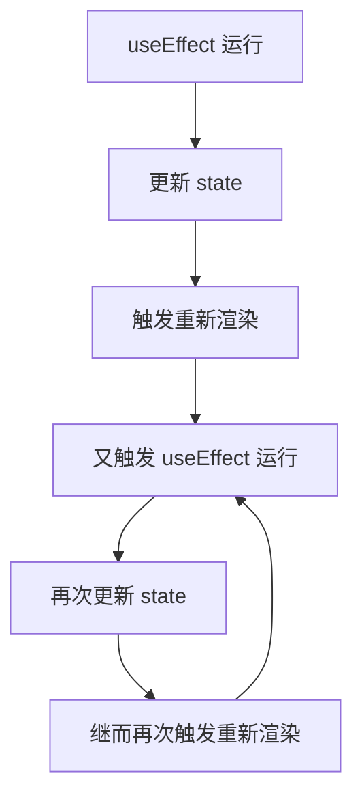

### 问题分析
useEffect 在渲染结束后运行。更新 state 会触发重新渲染。在 useEffect 中直接更新条件里的 useState 就像是把电源插座的插头插回自身：useEffect 运行，更新 state，触发重新渲染，于是又触发 useEffect 运行，再次更新 state，继而再次触发重新渲染。如此反复，从而陷入死循环。

默认情况下，useEffect 会在每次渲染后运行。

## 9. Concurrent Mode

### 为什么引入 Concurrent Mode
如果我们用「重编译时还是运行时」区分前端框架。那么Vue就是「重编译时」的杰出代表。而React由于使用JSX（而非模版语法）描述视图，走的是「重运行时」的路线。

### 「重编译时」的框架 —— Vue

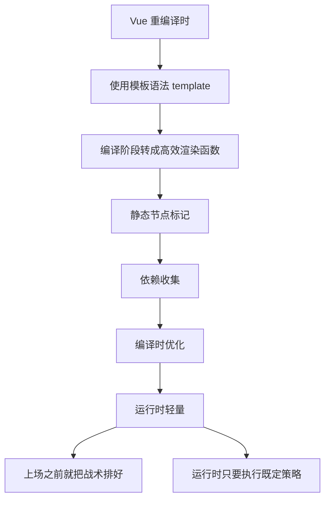

### 「重运行时」的框架 —— React

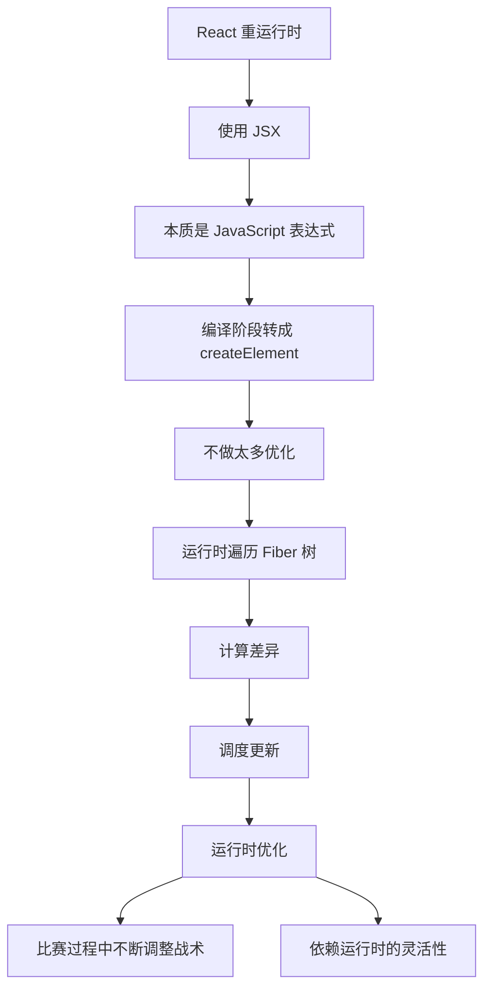

### 为什么要引入 Concurrent Mode

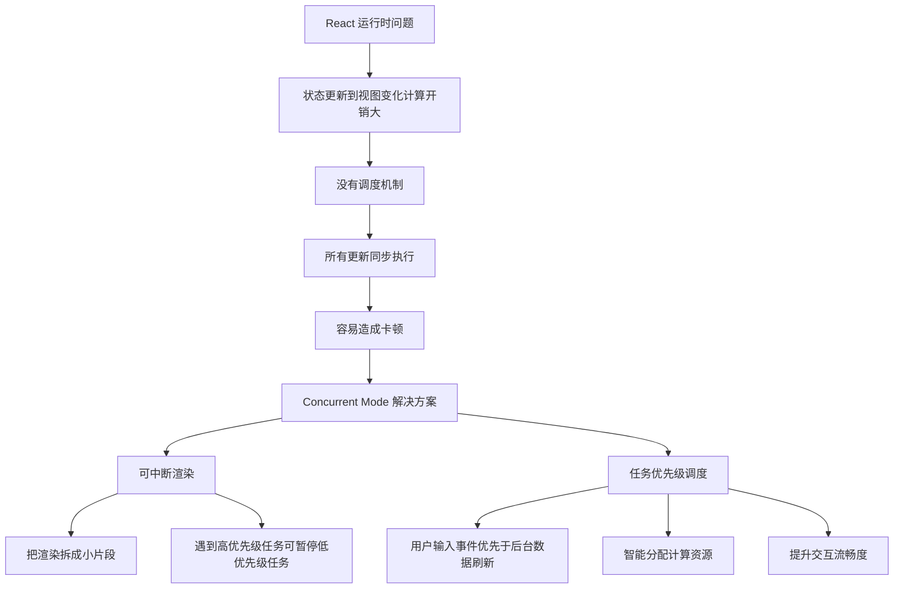

### Vue vs React 的优化方式对比

| 特性/维度 | Vue（重编译时） | React（重运行时） |
|---------|----------------|------------------|
| 视图描述方式 | 模板语法 (<template>) | JSX（JavaScript 表达式） |
| 优化时机 | 编译阶段：在构建时分析模板，生成高效渲染函数 | 运行时：在渲染过程中遍历 Fiber 树，动态调度更新 |
| 典型优化手段 | 静态节点标记、依赖收集、预编译指令 | React.memo、PureComponent、shouldComponentUpdate 等运行时优化 |
| 渲染架构 | Virtual DOM + 编译时优化 | Fiber 架构（支持可中断渲染） |
| 性能瓶颈 | 编译时已优化，运行时压力较小 | 状态更新到视图变化之间的计算量大，容易卡顿 |
| 解决方案 | 编译器提前生成最优渲染逻辑 | 引入 Concurrent Mode：任务拆分 + 优先级调度 |
| 用户体验 | 流畅度依赖编译器优化结果 | 流畅度依赖运行时调度，能动态响应高优先级任务 |

### 总结
- Vue：靠编译器提前优化，运行时更轻量
- React：靠运行时调度（Fiber + Concurrent Mode）来保证流畅交互
- Concurrent Mode 的引入，就是为了让 React 在"重运行时"的路线下，也能像 Vue 一样流畅，但通过任务优先级 + 可中断渲染来实现

## 10. 浏览器渲染机制

### JS线程和UI线程为什么互斥

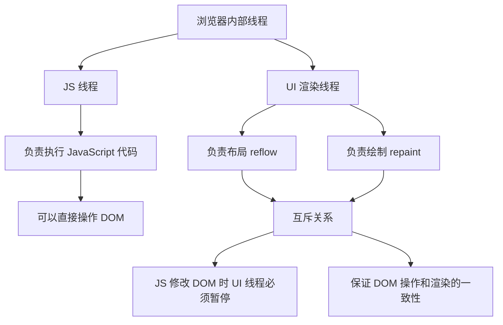

### 当 JS 影响 UI 时会发生什么

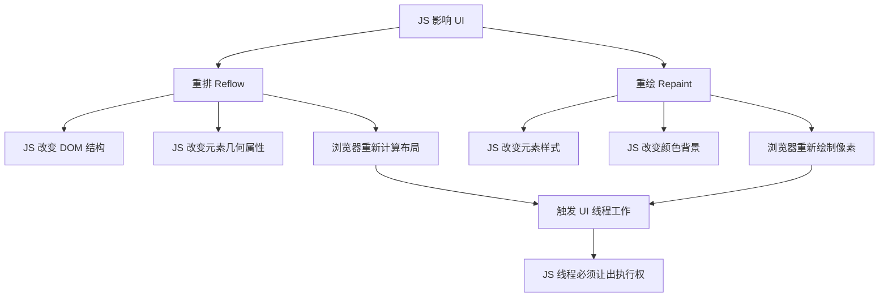

### 性能影响

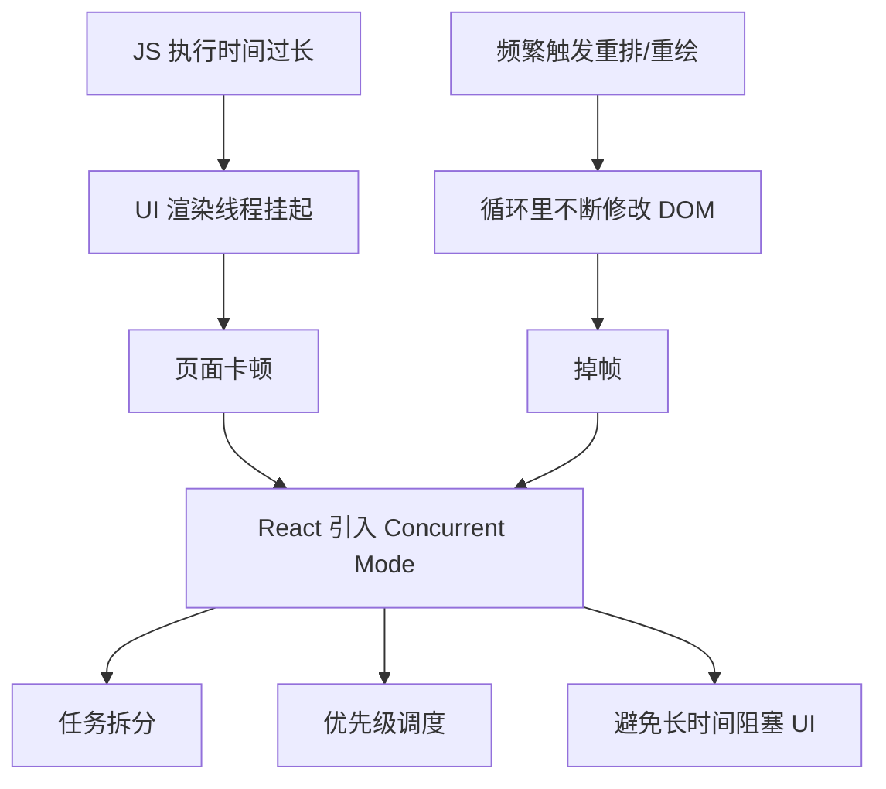

### 总结
- JS 线程和 UI 线程互斥，是为了保证 DOM 操作和渲染的一致性
- 当 JS 修改 DOM 或样式时，会触发重排（Reflow）和重绘（Repaint）
- 如果 JS 执行过久或频繁触发这些操作，就会造成页面卡顿
- React 引入 Concurrent Mode 通过任务拆分和优先级调度，避免长时间阻塞 UI
