# React 状态管理

## 1. React 单向数据流

### 为什么 React 选择单向数据流

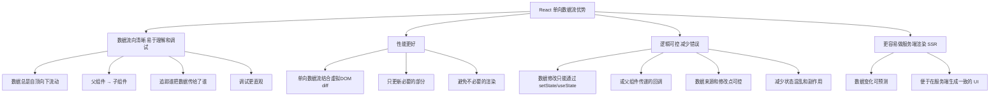

### 单向数据流工作流程

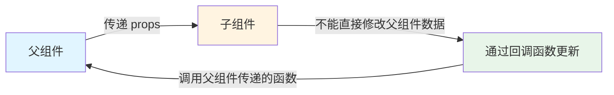

## 2. React 单向数据流 vs Vue 双向绑定

### 对比表

| 对比维度 | React（单向数据流） | Vue（双向绑定） |
|---------|-------------------|----------------|
| 数据流向 | 数据只能从父组件 → 子组件(props)，子组件不能直接修改父组件数据 | 数据可以在视图和数据模型之间双向流动(v-model) |
| 状态更新 | 必须通过 setState / useState / 状态管理库来更新，触发重新渲染 | 模型数据变化会自动更新视图，视图输入也会自动更新模型 |
| 可控性 | 数据修改点集中，逻辑清晰，可预测性强 | 修改来源可能分散，调试时需要追踪数据的双向流动 |
| 性能 | 结合虚拟 DOM diff，减少不必要的更新，性能更稳定 | 双向绑定需要依赖响应式系统(getter/setter 或 Proxy)，小项目方便，大项目需注意性能优化 |
| 调试难度 | 单向数据流，数据来源明确，调试相对简单 | 双向绑定可能导致"谁改了数据"不清晰，调试复杂度更高 |
| 适用场景 | 大型复杂应用，状态管理严格，可预测性要求高 | 中小型项目，表单交互频繁，开发效率优先 |
| 典型写法 | `<Child count={count} onChange={setCount} />` | `<input v-model="message" />` |

### 数据流对比图

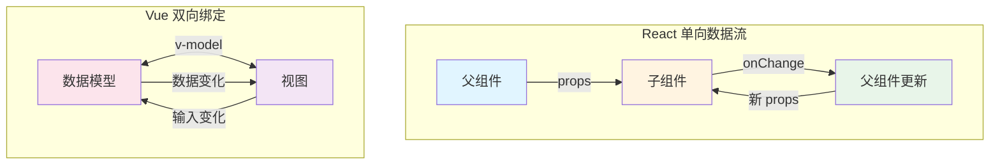

## 3. React 状态管理方案

### 状态管理层次

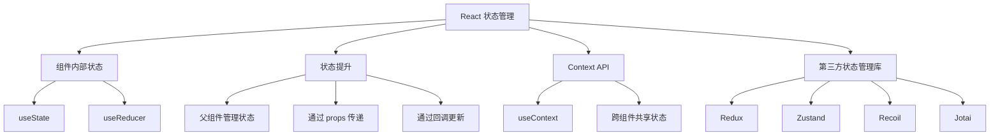

### 不同状态管理方案对比

| 方案 | 适用场景 | 优点 | 缺点 |
|------|---------|------|------|
| useState | 组件内部简单状态 | 简单直接，React 内置 | 不适合跨组件共享 |
| useReducer | 复杂状态逻辑 | 状态逻辑集中，易于测试 | 代码量相对较多 |
| Context API | 跨组件共享状态 | 无需额外依赖，React 内置 | 性能问题，容易导致不必要的渲染 |
| Redux | 大型应用复杂状态 | 生态完善，中间件丰富，调试工具强大 | 样板代码多，学习曲线陡峭 |
| Zustand | 中小型项目 | 简单轻量，API 简洁，无 Provider 包裹 | 生态相对较小 |
| Recoil | 原子化状态管理 | 细粒度更新，与 React 紧密集成 | 相对较新，生态不够成熟 |

## 4. Redux 状态管理

### Redux 核心概念

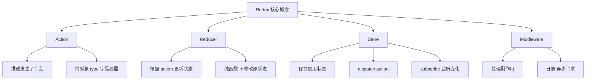

### Redux 数据流

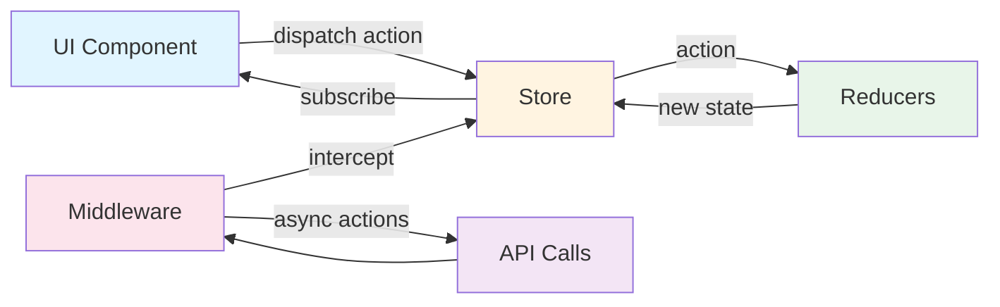

## 5. Zustand 状态管理

### Zustand 特点

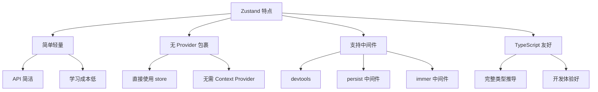

### Zustand 使用示例

```javascript
import create from 'zustand';

// 创建 store
const useStore = create((set) => ({
  count: 0,
  increment: () => set((state) => ({ count: state.count + 1 })),
  decrement: () => set((state) => ({ count: state.count - 1 })),
}));

// 在组件中使用
function Counter() {
  const { count, increment, decrement } = useStore();

  return (
    <div>
      <p>Count: {count}</p>
      <button onClick={increment}>+</button>
      <button onClick={decrement}>-</button>
    </div>
  );
}
```

## 6. Context API 状态管理

### Context API 使用场景

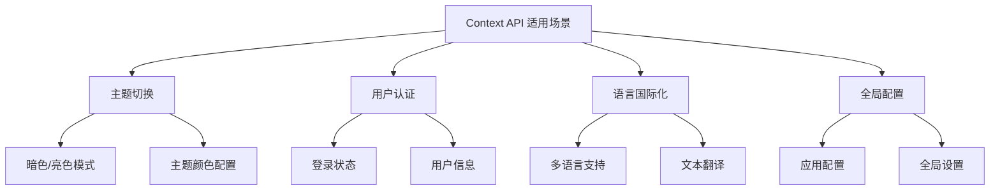

### Context API 使用示例

```javascript
// 创建 Context
const ThemeContext = React.createContext();

// 创建 Provider
function ThemeProvider({ children }) {
  const [theme, setTheme] = useState('light');

  return (
    <ThemeContext.Provider value={{ theme, setTheme }}>
      {children}
    </ThemeContext.Provider>
  );
}

// 使用 Context
function ThemedButton() {
  const { theme, setTheme } = useContext(ThemeContext);

  return (
    <button
      style={{ backgroundColor: theme === 'light' ? '#fff' : '#333' }}
      onClick={() => setTheme(theme === 'light' ? 'dark' : 'light')}
    >
      Toggle Theme
    </button>
  );
}
```

## 7. 状态管理最佳实践

### 状态分类

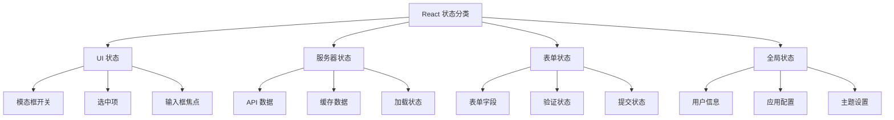

### 状态管理选择指南

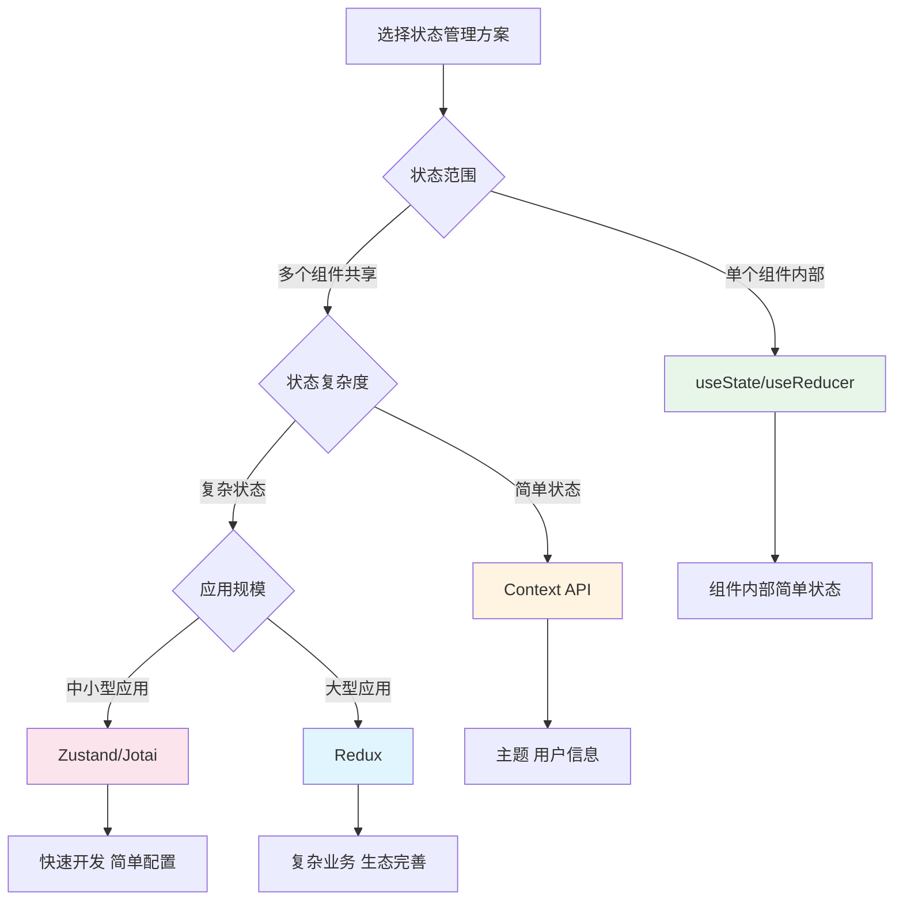

## 8. 性能优化技巧

### 避免不必要的渲染

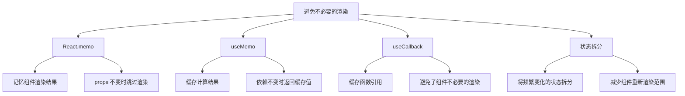

### 状态管理性能优化示例

```javascript
// 使用 React.memo 优化子组件
const ExpensiveChild = React.memo(function ExpensiveChild({ data, onUpdate }) {
  // 组件逻辑
});

// 使用 useMemo 缓存计算结果
const processedData = useMemo(() => {
  return expensiveCalculation(data);
}, [data]);

// 使用 useCallback 缓存函数
const handleUpdate = useCallback((newValue) => {
  onUpdate(newValue);
}, [onUpdate]);

// 状态拆分
const [name, setName] = useState('');
const [age, setAge] = useState(0);
// 而不是
const [user, setUser] = useState({ name: '', age: 0 });
```
